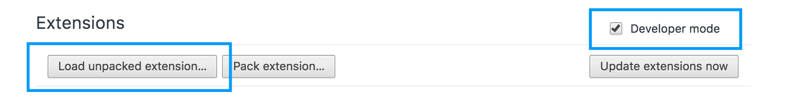

# Chrome OS app file download example

This is an example on how to download a file in a Chrome OS packaged app using the HTML5 FileSystem API. The action happens in the background without any user interaction like selecting a folder or saving a file.

The motivation for this repo was that to put together bits and pieces I found around the web for myself and others.

I'm using ES6/ES7 without Babel because at this point Chromebooks can be considered evergreen browsers. I'm using Axios because I prefer it to Fetch or XHR.

Look at the source code and console for hints.

To test this app open the extensions panel in Chrome, enable developer mode, click on `Load unpacked extension...`, select the `app` folder, then click `Launch`.

